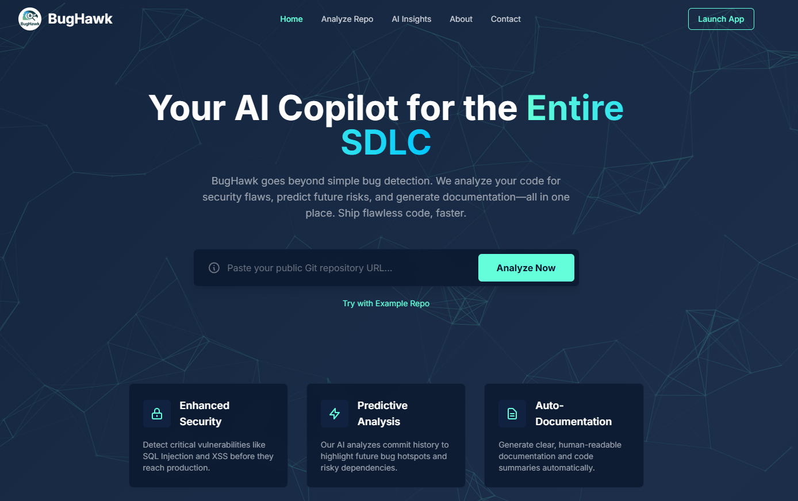
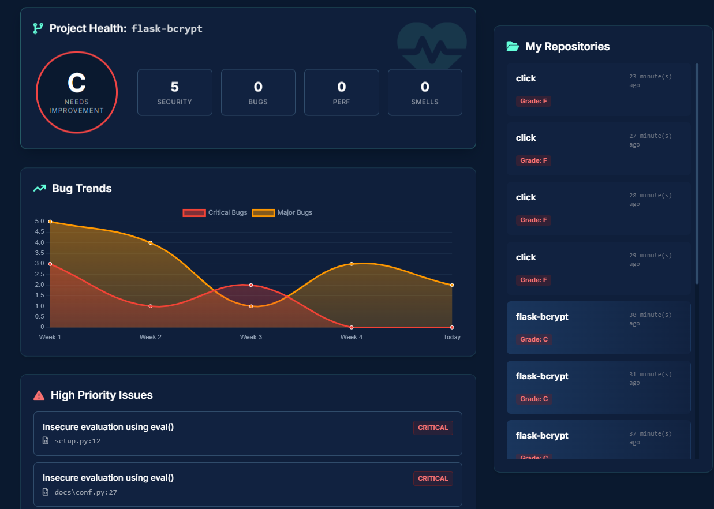
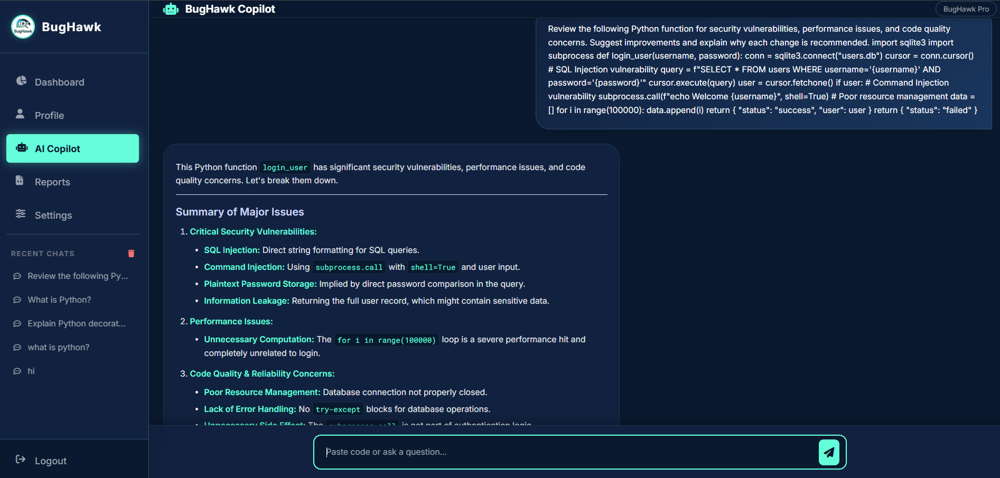
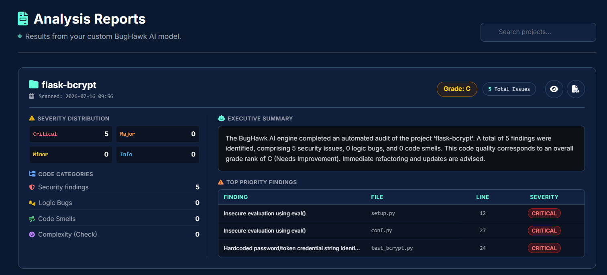

# BugHawk

An AI-powered static code analysis platform that combines security scanners (Bandit, Ruff, Radon, pip-audit) with Google Gemini-generated explanations, an interactive AI Copilot, and downloadable PDF reports — all in a single Flask web application.

[](https://python.org)
[](https://flask.palletsprojects.com)
[](LICENSE)

---

## Key Features

- Scan any public GitHub repository and receive a graded health report (A+ to F)
- Security vulnerability detection via Bandit with CVE-level detail
- Linting and code quality analysis via Ruff
- Cyclomatic complexity scoring via Radon
- Dependency CVE scanning via pip-audit
- AI-generated explanations for every finding, batched into a single Gemini API call
- Conversational AI Copilot with full Markdown rendering and code highlighting
- One-click PDF report generation with executive summary
- GitHub OAuth login, email OTP verification, and Two-Factor Authentication
- Full scan history with per-report drill-down

---

## Tech Stack

| Layer | Technologies |
|---|---|
| Web Framework | Flask, SQLAlchemy, SQLite |
| ML Backend | FastAPI, Hugging Face Transformers, DistilBERT, Qwen2.5-Coder |
| Security Scanners | Bandit, Ruff, Radon, pip-audit |
| AI Services | Google Gemini 2.5 Flash |
| Auth | Flask-Login, Flask-Mail, Authlib (GitHub OAuth) |

---

## Architecture

```
Browser
  └── Flask Frontend
        └── ScanManager
              ├── Bandit  ──┐
              ├── Ruff    ──┤── Merged findings
              ├── Radon   ──┤      └── Gemini (single batch request)
              └── pip-audit─┘            └── Dashboard / PDF Report

AI Copilot ──── FastAPI ML Backend (DistilBERT + Qwen2.5-Coder)
                       └── Google Gemini (response generation)
```

---

## Screenshots

| Login | Dashboard |
|---|---|
|  |  |

| AI Copilot | Repository Report |
|---|---|
|  |  |

---

## Installation

**Prerequisites:** Python 3.11+, Git

```bash
git clone https://github.com/your-org/bughawk.git
cd bughawk
```

**Frontend**
```bash
cd Frontend
python -m venv venv && venv\Scripts\activate   # Windows
# source venv/bin/activate                     # macOS / Linux
pip install -r requirements.txt
```

**Backend**
```bash
cd Backend
python -m venv .venv && .venv\Scripts\activate
pip install -r requirements.txt
```

---

## Environment Variables

Create `Frontend/.env`:

| Variable | Description |
|---|---|
| `SECRET_KEY` | Flask session secret (generate with `secrets.token_hex(32)`) |
| `GEMINI_API_KEY` | Google AI Studio API key |
| `MAIL_USERNAME` | Gmail address for OTP emails |
| `MAIL_PASSWORD` | Gmail App Password |
| `GITHUB_CLIENT_ID` | GitHub OAuth App client ID |
| `GITHUB_CLIENT_SECRET` | GitHub OAuth App client secret |

Create `Backend/.env`:

| Variable | Description |
|---|---|
| `token_hf` | Hugging Face API token |

---

## Running

```bash
# Frontend  →  http://127.0.0.1:5000
cd Frontend && python app.py

# Backend   →  http://127.0.0.1:8000
cd Backend && python main.py
```

The backend is only required for AI Copilot intent classification. All scanner and Gemini functionality runs through the frontend independently.

---

## Project Structure

```
bughawk/
├── Frontend/
│   ├── app.py                  # Routes, DB models, auth
│   ├── scanner/                # Analysis engine
│   │   ├── manager.py          # Orchestrates all scanners
│   │   ├── bandit_scanner.py
│   │   ├── ruff_scanner.py
│   │   ├── radon_scanner.py
│   │   ├── pip_audit_scanner.py
│   │   ├── scoring.py          # Health score and grading
│   │   └── report.py           # Report model and serializer
│   ├── ai/
│   │   ├── explainer.py        # Gemini batch explanation engine
│   │   └── templates.py        # Deterministic fallback explanations
│   ├── templates/              # Jinja2 HTML templates
│   └── static/                 # Assets
├── Backend/
│   ├── main.py                 # FastAPI app
│   └── models/                 # ML model loading and inference
├── docs/
└── README.md
```

---

## Team

Om Karkele | Aditya Katkar | Kartik Mandhane  | Yash Kashid | 

---

## Contact

**Email:** omtechservices.dev@gmail.com

---

## License

[MIT License](LICENSE) — © 2025 BugHawk by Team BugHawk. All rights reserved.
